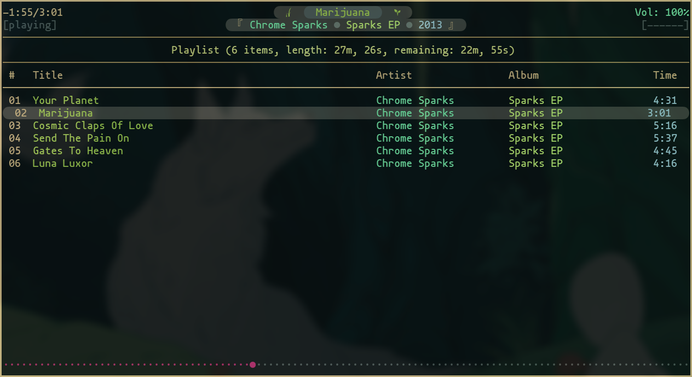
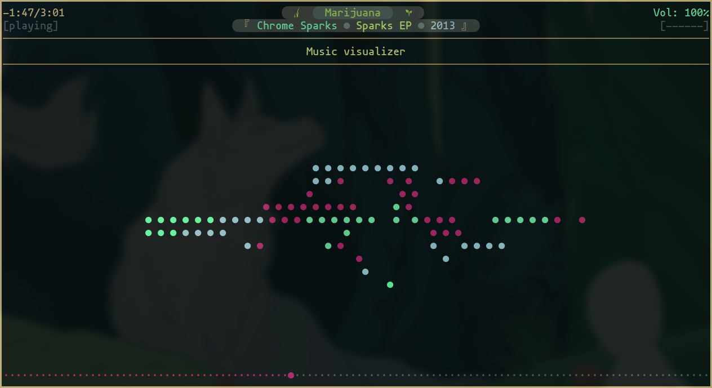
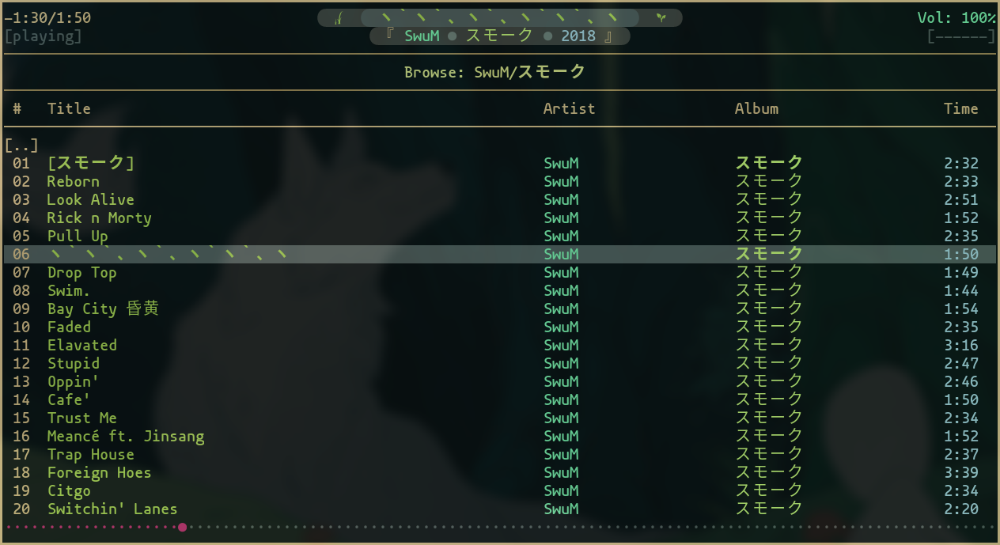
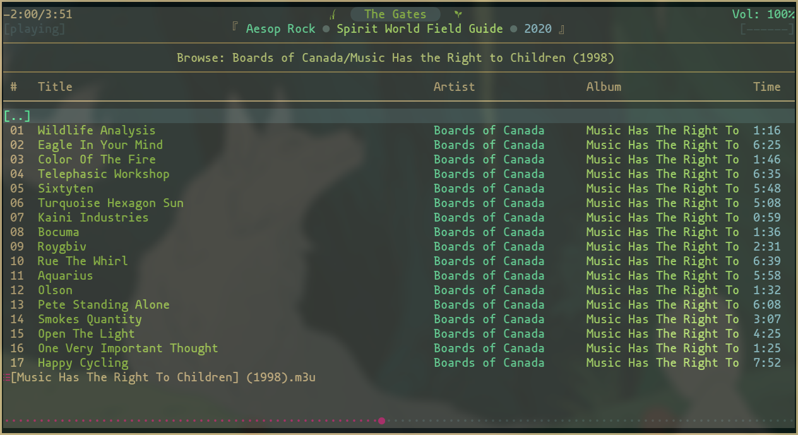
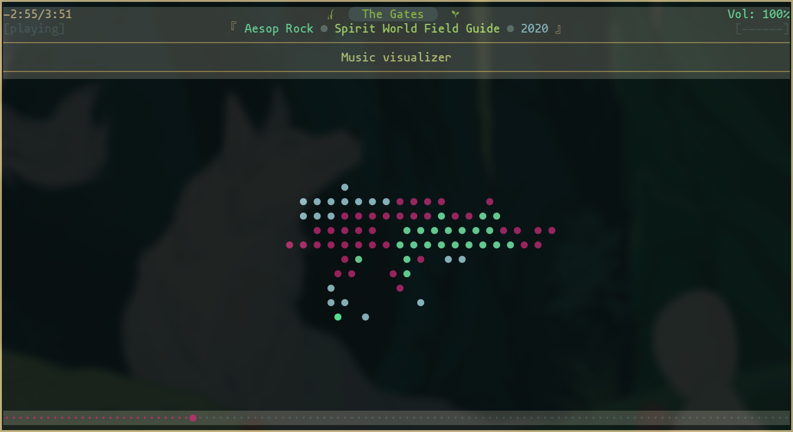

# Mokujin ncmpcpp Theme
A theme for [ncmpcpp](https://rybczak.net/ncmpcpp/) based on the Mokujin colorway


## About
Just a couple dotfiles for ncmpcpp for the Mokujin terminal palette.  There's a light and dark version since I couldn't decide which I liked better.  Tested with **ncpmcpp 0.9.2**.


## Screenshots
### Dark version



### Light version




## Requirements
While not strictly *required*, it definitely wont look the same without the same without them.
- **mononoki Nerd Fonts** or **Nerd Fonts Complete**
- **Noto CJK fonts**
- 


## Installation
### Fonts
For arch users the noto fonts can be found in **extra** and the Nerd Fonts can be found in **aur**.

```
pacman -S noto-fonts-cjk
yay -S nerd-fonts-complete
```

### Dotfile
Make sure your terminal fonts and colours are set up from the terminal theme.  Pick which file you want and copy it to `~/.config/ncmpcpp/config` (or where ever else you might keep yout ncmpcpp dir.)


## Troubleshooting
If you're experiencing text rendering issues, make sure the necessary font packages in the requirements section are installed and update your font cache with `fc-cache -f`.  You will probably need to restart your terminal afterwards.


## License
This stuff is licensed under the GNU General Public License v3+.  See LICENSE for details.
